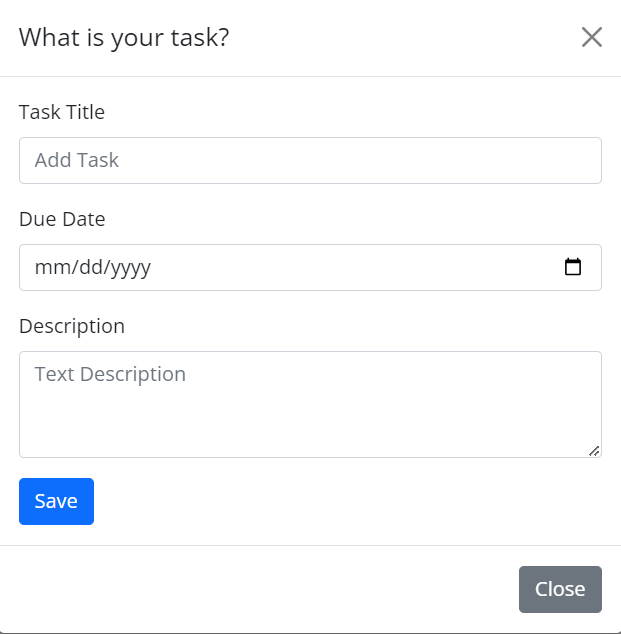

# Project-Navigator

Project Navigator is a task board application that empowers teams to streamline project management and enhanace collaboration. This website provides you a visual overview of tasks and project progress, enabling team members to easily track, assign, and prioritize work. 

## Installation and Usage

Click on the link on the bottom of this page to start using the Project Navigator! On this app, you can 
- Create tasks
    - Add the task title, a description, and the due date 
- Organize tasks
    - Drag and drop tasks between columns to reflect their current status. 
- Monitor Project Progress

 

## Links

Deployment Link: 

Repository Link: 

## Credits

W3 Schools, MDN Web Docs, Xpert Learning Assistant, ChatGPT 

## License

This project is licensed under MIT License. For more information please click on the badge below: 

 

